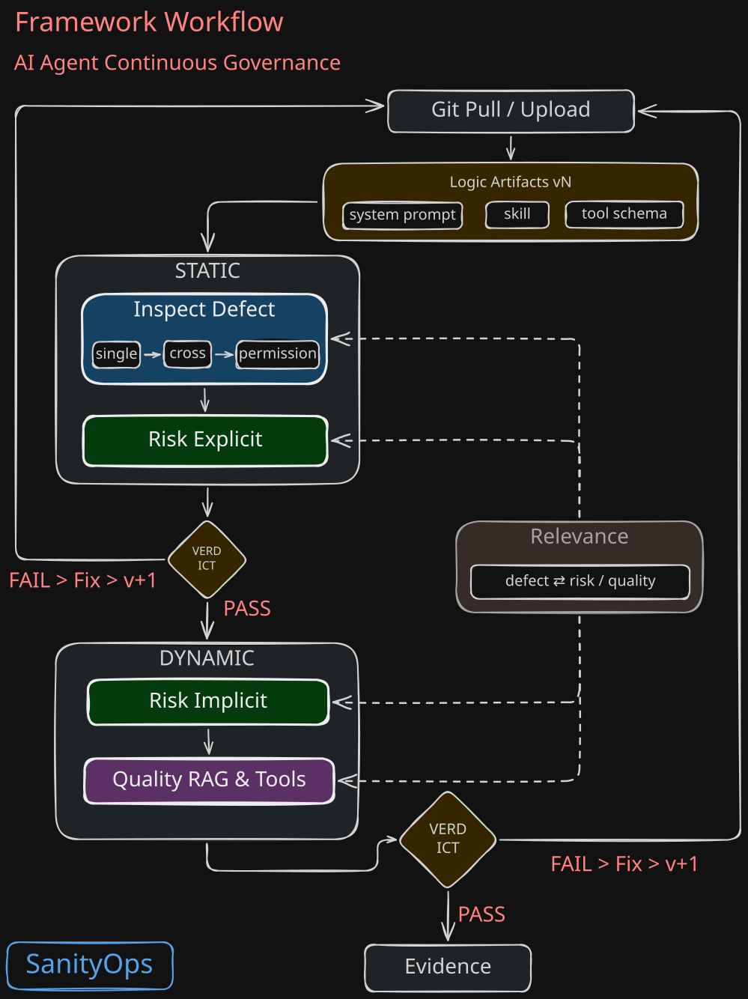

<picture>
  <source srcset="/assets/sanityops-logo-github-w.svg" media="(prefers-color-scheme: dark)" />
  
</picture>

# SanityOps Framework

## AI Agent Continuous Governance

---

[](https://github.com/sanityops-org/sanityops-framework) [](https://creativecommons.org/licenses/by-sa/4.0/) [](https://github.com/sanityops-org/sanityops-framework)

---

> A vendor-neutral, enterprise-grade quality and safety governance framework covering the full lifecycle of AI Agents.

<details>
<summary>Table of Contents</summary>

- [Background](#background)
- [Introduction](#introduction)
- [Key Features](#key-features)
- [Architecture](#architecture)
- [Value](#value)
- [Get Started](#get-started)
- [Use Cases & Capabilities](#use-cases--capabilities)
- [Relationship with Harness](#relationship-with-harness)
- [Ecosystem](#ecosystem)
- [Terminology](#terminology)
- [Road Map](#road-map)
- [Contributing](#contributing)
- [License](#license)
- [Contact Us](#contact-us)

</details>

---

## Background

Runtime evaluation of an Agent's output quality and detection of sophisticated logical attacks fall into an "impossible triangle" — business real-time requirements, judgment complexity, and long context — which is a fundamental constraint that cannot be solved through engineering alone. As a result, the industry consensus is to shift checks left into CI/CD. But once shifted left, what exactly should be checked, what criteria should be checked against, and what standard should be used to grant release? The high-frequency, hot-iteration nature unique to Agents causes the same class of problems to recur every time a Prompt, Skill, or Tool Schema is modified. SanityOps is designed precisely to answer these three questions.

---

## Introduction

The output quality and logical vulnerabilities of an Agent are closely tied to the rigor of each logical artifact (Prompt, Skill, Tool Schema, Permission), manifesting as a wide variety of defects as well as permission requests disproportionate to the assigned responsibilities.

In our evaluation of both publicly available and internal enterprise Agent logical artifacts, over 90% of samples contained at least one defect as defined by the Inspect rules; this phenomenon is widespread not only in human-written logical artifacts but also in LLM-generated ones.

Therefore, we start from the inspection and remediation of defects and permissions in logical artifacts, and extend to evaluating Agent output quality and detecting logical risks.

Through near-real-time synchronization with Git and shadow sandbox that mirror production, SanityOps weaves defect inspection, permission checks, explicit/implicit risk audits, and quality evaluation into a continuous governance loop that runs in lockstep with rapid iteration.

---

### Framework and Platform

SanityOps has two parts:

1. **Framework (the specification)** — the complete methodology across Inspect, Risk, Quality, Relevance, and Core, published as open specification documents (CC BY-SA 4.0).

2. **Platform (the tooling)** — the set of tools that implement the specifications above:
   
   - 🟢 **Open source** — the standalone Defect Inspector CLI (Apache 2.0, supporting L1/L2/L3).
   
   - 🔵 **Commercial** — the full feature suite (Defect Inspector, Risk Scanner, Quality Evaluator), offered as hosted, SaaS, or self-deployed services.

---

## Key Features

- Like a "compiler" for AI logic, it establishes a complete inspection framework targeting defects in logical artifacts (→ Inspect);
- Establishes mapping relationships among defects, permissions, quality, and risk, aiding problem localization and remediation (→ Relevance / Inspect Permission);
- Establishes methods for generating test cases and mock data based on logical artifacts, making Red Team exercises more targeted and effective (→ Risk Implicit / Quality);
- Establishes dedicated quality evaluation dimensions and metric systems tailored to the distinct service forms of RAG-Agents and Tool-Agents respectively (→ Quality RAG-Agent / Quality Tool-Agent);
- Performs dynamic verification in a shadow environment equivalent to production, more closely reflecting real operating conditions than traditional sandboxes (→ Risk Implicit);
- A ratchet mechanism synchronized with logical artifact versions provides a simple yet effective production-line admission method for hot iterations (→ Quality / Core: Baseline & Gate).

---

## Architecture

### Division of Labor Among Subsets

```
SanityOps Framework
│
├─ Inspect (Defect Inspection)
│   ├─ Inspect Prompt ← System Prompt defect inspection
│   ├─ Inspect Skill ← Skill defect inspection
│   ├─ Inspect Tool ← Tool Schema defect inspection
│   ├─ Inspect Cross ← Cross-Artifact defect inspection
│   └─ Inspect Permission ← Permission-responsibility proportionality inspection (QD-PM)
│
├─ Risk (Risk Scanning)
│   ├─ Risk Explicit ← Explicit Logic Artifact risk detection
│   └─ Risk Implicit ← Implicit Agent runtime vulnerability scanning
│
├─ Quality (Service Quality)
│   ├─ Quality RAG-Agent ← RAG-Agent service quality assessment
│   └─ Quality Tool-Agent ← Tool-Agent service quality assessment
│
└─ Relevance (Impact Mapping)
    └─ Relevance ← defect → risk/quality diagnostic mapping
```

### Framework Workflow

Inspect performs static defect, permission and explicit risk checks on logical artifacts; Relevance maps discovered defects to Risk attack surfaces and Quality failure modes; Risk (implicit) and Quality complete dynamic verification and evaluation in the shadow sandbox; finally, Gate makes the release decision based on the baseline and ratchet mechanism. This closed loop automatically reruns with every logical artifact version change.



---

## Value

| Role                                | One-line description                                                                                                                                 |
| ----------------------------------- | ---------------------------------------------------------------------------------------------------------------------------------------------------- |
| **CTO/CIO**                         | Design a standardized quality and safety scaffold for enterprise AI projects, backed by quantified scores                                            |
| **Agent Developer/Tester**          | Improve the quality and efficiency of logical artifact development and testing with guiding frameworks and automated tools                           |
| **Agent Quality Assurance**         | Provide quantifiable evaluation and admission decisions for Agent quality in sync with versioning, continuously controlling regression risk          |
| **Agent Security Audit**            | Detect explicit and implicit Agent risks in sync with versioning, establish a quantifiable security baseline, and re-verify on every artifact change |
| **Platform Engineer**               | Integrate the governance process into CI/CD to form an automated closed loop of hot iteration, quality, and safety                                   |
| **FDE (Forward Deployed Engineer)** | Provide reliable, high-quality practice guidance for enterprise Agents                                                                               |

---

## Get Started

The framework specification is fully open; the Inspect CLI is open source (Apache 2.0); Risk and Quality are offered as a SaaS demo and self-hosted deployment.

- **Read the framework** — a guided reading path: [Read the Framework](framework/read-the-framework.md)
- **Try the Inspect CLI** — install and run static defect checks locally or in CI/CD: [Try the Tools](framework/try-the-tools.md) · `pip install sanityops-cli`
- **Try the live demo** — the full Inspect + Risk + Quality loop: [demo.sanityops.org](https://demo.sanityops.org/)

---

## Use Cases & Capabilities

| Scenario                                    | Typical Example                                                                                                                          | Reference Document                                             | Tool                 |
| ------------------------------------------- | ---------------------------------------------------------------------------------------------------------------------------------------- | -------------------------------------------------------------- | -------------------- |
| **Prompt quality self-check**               | Before submitting a new System Prompt, check for contradictions, unclear boundaries, missing permissions, and other defects              | [Inspect Prompt](inspect/prompt.md)                            | 🟢 Defect Inspector  |
| **Skill definition audit**                  | Check whether the Skill's trigger conditions, permission declarations, and failure strategy contain logical flaws                        | [Inspect Skill](inspect/skill.md)                              | 🟢 Defect Inspector  |
| **Tool Schema compliance check**            | Verify whether Tool Schema parameter constraints and side-effect declarations comply with specifications                                 | [Inspect Tool](inspect/tool.md)                                | 🟢 Defect Inspector  |
| **Cross-artifact consistency verification** | Verify whether authorization, parameters, and contracts among Prompt–Skill–Tool are consistent                                           | [Inspect Cross](inspect/cross.md)                              | 🟢 Defect Inspector  |
| **Permission proportionality check**        | Check whether permissions granted to an Agent exceed its responsibility boundaries, evaluating permission-responsibility proportionality | [Inspect Permission](inspect/permission.md)                    | 🟢 Defect Inspector  |
| **Explicit risk audit**                     | Audit and quantitatively grade dangerous expressions, scripts, and dangerous authorizations in logical artifacts                         | [Risk Explicit](risk/explicit.md)                              | 🔵 Risk Scanner      |
| **Implicit risk attack verification**       | Simulate sophisticated logical attacks in the shadow environment to detect runtime vulnerabilities                                       | [Risk Implicit](risk/implicit.md)                              | 🔵 Risk Scanner      |
| **Tool-Agent reliability evaluation**       | Evaluate the task success rate of tool-based Agents, establishing risk-driven testing rigor                                              | [Quality Tool-Agent](quality/tool-agent.md)                    | 🔵 Quality Evaluator |
| **RAG-Agent quality evaluation**            | Evaluate knowledge-based Agents' accuracy, completeness, relevance, traceability, and timeliness through four dimensions and 12 metrics  | [Quality RAG-Agent](quality/rag-agent.md)                      | 🔵 Quality Evaluator |
| **Enterprise Agent go-live admission**      | Before an enterprise's Agent goes live, pass three Gates — Inspect + Risk + Quality — and generate a release report                      | [Core](framework/core.md), [Relevance](framework/relevance.md) | 🔵 Full tool suite   |
| **Defect→Risk/Quality diagnosis**           | Link defects found by Inspect to Risk attack surfaces and Quality failure modes to locate root causes                                    | [Relevance](framework/relevance.md)                            | 🔵 Full tool suite   |
| **Quality regression**                      | After a logical artifact is modified, regression testing reveals quality degradation, forming the basis for release decisions            | [Quality RAG-Agent](quality/rag-agent.md)                      | 🔵 Quality Evaluator |
| **Compliance audit evidence generation**    | Provide auditors with traceable version records, evaluation reports, and Gate decision evidence                                          | [Core](framework/core.md)                                      | 🔵 Full tool suite   |

---

## Relationship with Harness

Harness faithfully executes rules but cannot judge whether the rules themselves are right or wrong — if the blueprint is flawed, it will simply faithfully execute a wrong rule. What SanityOps adds is exactly this layer: at the logic-design stage, it discovers and fixes defects in Prompts, Skills, Tool Schemas, and permission configurations, ensuring that the constraints Harness relies on at runtime have already been validated, after which Gate decides the timing of release. Harness makes sure rules are executed correctly; SanityOps makes sure the rules are worth executing.

---

## Ecosystem

See how SanityOps relates to other tools and frameworks:

- [SanityOps Positioning](/compare/sanityops-positioning.md) — Framework positioning and ecosystem relationships
- [SanityOps and FDE](/compare/sanityops-and-fde.md) — Relationship with Forward Deployed Engineers
- [SanityOps and Harness](/compare/sanityops-and-harness.md) — Relationship with Harness runtime layer
- [SanityOps vs Promptfoo](/compare/compare-with-promptfoo.md) — Red teaming and adversarial testing
- [SanityOps vs RAGAS](/compare/compare-with-ragas.md) — RAG evaluation and quality metrics
- [SanityOps vs NVIDIA SkillSpector](/compare/compare-with-skillspector.md) — Skill security scanning

---

## Terminology

Terms appearing in this document such as logical artifact, Prompt / Skill / Tool Schema / Permission, ratchet mechanism, shadow sandbox, explicit/implicit risk, Gate, Baseline, and Harness are all standardized against the Core Appendix A terminology glossary as the baseline.

---

## Road Map

**v1.0 · September 2026**

- ✅ Framework 1.0 core specification released
- ✅ A complete methodology system for Inspect, Risk, Quality, and Relevance has been formed
- ✅ Defect Inspector tool fully open-sourced, with a free CLI provided
- ✅ Full feature suite offer commercial SaaS / Self-hosted services / Report

**v2.0 · November 2026**

- 🔜 DMC 1.0 derivative model capability evaluation and optimization method

---

## Contributing

You are welcome to participate in improvements via Issues, Pull Requests, or Discussions:

- Submit new logical artifact defect patterns
- Share risk audit and attack verification cases
- Contribute quality evaluation benchmarks and test sets
- Discuss the evolution of terminology, rules, grading, and Gate

---

## License

The Framework specification of this project is licensed under CC BY-SA 4.0; the open-source Inspect CLI is separately licensed under Apache 2.0.

---

## Contact Us

- Website: `https://www.sanityops.org`
- GitHub: `https://github.com/sanityops-org/sanityops-framework`
- Discussions: `https://github.com/sanityops-org/sanityops-framework/discussions`
- Email: `hello@sanityops.org`
